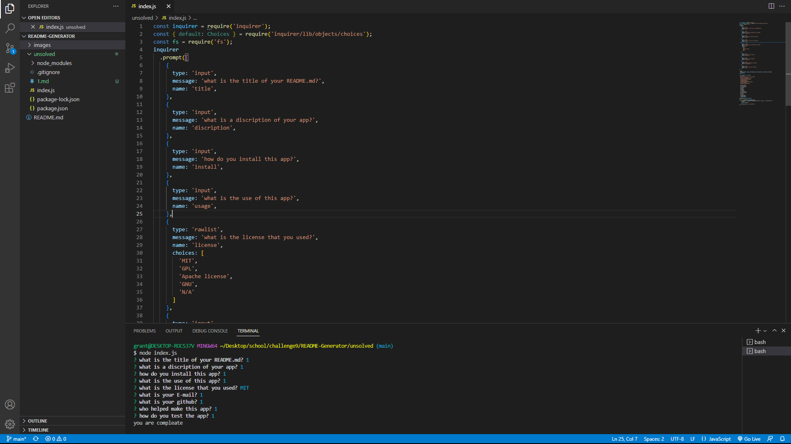

# read-me-generator
  ## Table of Contents
  ### *[discription](#discription)
  ### *[Installation](#install)
  ### *[Usage](#usage)
  ### *[visuals](#visuals)
  ### *[License](#license)
  ### *[Contributing](#Contributing)
  ### *[Tests](#test)
  ### *[Questions](#questions)

  ## discription:
  this app lets you make a read me from scratch with not having to go in a read me file and make one so no need to having to go back and make your own from scratch each time.
  ## Installation:
  all you do to install is go on my repository and then run the insex.js in your own repository
  ## visuals:

  ## Usage:
  to make good readmes and to shorten the time it takes to make them
  ## License:
  N/A
  ## Contributing:
  it was just me on the project
  ## Tests:
  all you do to run the app is indes.js in the terminal
  ## Questions:
  *gfinnie01
  *grantfinnie0@gmail.com